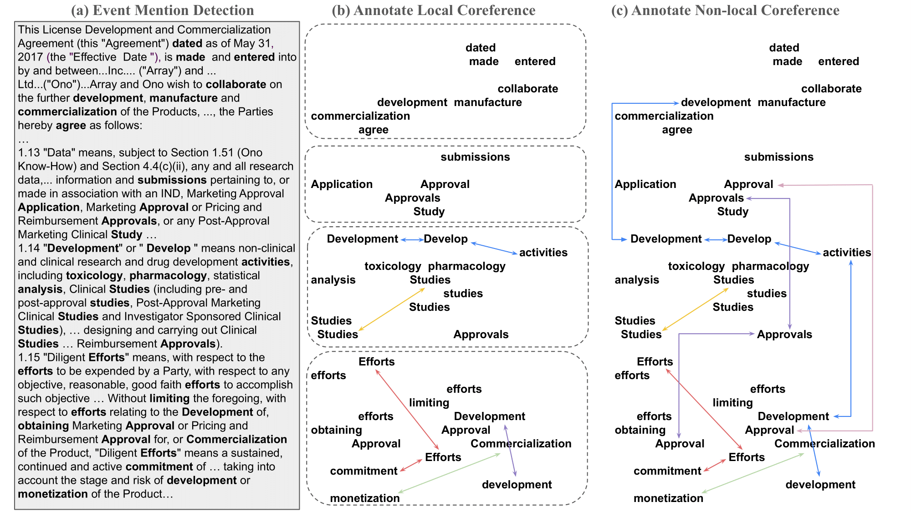

# LegalCore Dataset

LegalCore is the first dataset for the legal domain that has been annotated with comprehensive event and event coreference information.


## Raw Data
- The raw text data is available in the `./raw_data` directory in `.txt` format.

## Processed Data
- `data.jsonl`: Processed data formatted for LLM evaluation.
- `train.jsonl`: Processed data formatted for supervised learning baselines.

# Dataset Structure

## Data Structure for LLM evaluation

Each data instance is represented as a JSON object with the following keys:

### 1. `id` (String)
- A unique identifier for the document.

### 2. `tokens` (List of Strings)
- A list of tokens present in the document.

### 3. `sentences` (List of Strings)
- A list of sentences extracted from the document.

### 4. `text` (String)
- The full text content of the document.

### 5. `text_with_events` (String)
- The text content annotated with event mentions. Event mentions are marked with `{Ex EVENT_NAME}` notation, where `Ex` is the event ID.

### 6. `singleton_text` (String)
- A version of the document text where singleton events are marked.

### 7. `events` (List of Objects)
Each event is represented as an object with the following attributes:

- `id` (String): Unique event identifier.
- `mention` (List of Objects): A list of mentions corresponding to the event, where each mention contains:
  - `trigger_word` (String): The trigger word for the event.
  - `offset` (Integer): The position of the trigger word in the text.
  - `singleton_id` (String, Optional): The singleton event ID, if applicable.

## Example Data Entry

```json
{
  "id": "29",
  "tokens": ["Exhibit", "10.3", "[***]"],
  "sentences": [
    "Exhibit 10.3\n[***] INDICATES MATERIAL THAT HAS BEEN OMITTED AND FOR WHICH CONFIDENTIAL TREATMENT HAS BEEN REQUESTED .",
    "ALL SUCH OMITTED MATERIAL HAS BEEN FILED WITH THE SECURITIES AND EXCHANGE COMMISSION ..."
  ],
  "text": "Exhibit 10.3\n[***] INDICATES MATERIAL THAT HAS BEEN OMITTED ...",
  "text_with_events": "Exhibit 10.3\n[***] INDICATES MATERIAL THAT HAS BEEN {E2 OMITTED} ...",
  "singleton_text": "Exhibit 10.3 [***] INDICATES MATERIAL THAT HAS BEEN {E0 OMITTED} ...",
  "events": [
    {"id": "E2", "mention": [{"trigger_word": "OMITTED", "offset": 8, "singleton_id": "E0"}]},
    {"id": "E3", "mention": [{"trigger_word": "REQUESTED", "offset": 16, "singleton_id": "E1"}]},
    {"id": "E4", "mention": [{"trigger_word": "FILED", "offset": 24, "singleton_id": "E2"}]}
  ]
}
```

## Data Structure for Supervised Baseline

The dataset consists of a JSON object with the following fields:

### 1. `id` (string)
- A unique identifier for the dataset instance.

### 2. `tokens` (list of lists of strings)
- Tokenized text split into lists of words/phrases.
- Each inner list represents a sentence or segment of the document.

### 3. `words` (list of strings)
- A subset of the tokens representing key words in the document.

### 4. `sentences` (list of strings)
- A list of complete sentences extracted from the text.

### 5. `text` (string)
- The full text of the document.

### 6. `text_with_events` (string)
- The document text annotated with event tags.
- Event identifiers are enclosed in `{}` next to their corresponding words.

### 7. `singleton_text` (string)
- Similar to `text_with_events` but only contains singleton event annotations.

### 8. `events` (list of objects)
- A list of detected events in the document.
- Each event object contains:
  - `id` (string): A unique event identifier.
  - `mention` (list of objects): A list of instances where the event appears, each with:
    - `trigger_word` (string): The word that triggers the event.
    - `offset` (list of two integers): The position range of the trigger word.
    - `singleton_id` (string, optional): If applicable, the singleton ID associated with the event.
    - `sent_id` (integer): The sentence index in which the event occurs.
    - `globle_offset` (integer): The global position of the event in the document.

## Example

```json
{
  "id": "29",
  "tokens": [["Exhibit", "10.3", "[***]", "INDICATES", "MATERIAL"], ...],
  "words": ["Exhibit", "10.3", "[***]"],
  "sentences": ["Exhibit 10.3 [***] INDICATES MATERIAL THAT HAS BEEN OMITTED..."],
  "text": "Exhibit 10.3 [***] INDICATES MATERIAL THAT HAS BEEN OMITTED AND FOR...",
  "text_with_events": "Exhibit 10.3 [***] INDICATES MATERIAL THAT HAS BEEN {E2 OMITTED}...",
  "singleton_text": "Exhibit 10.3 [***] INDICATES MATERIAL THAT HAS BEEN {E0 OMITTED}...",
  "events": [
    {
      "id": "E2",
      "mention": [
        {
          "trigger_word": "OMITTED",
          "offset": [8, 9],
          "singleton_id": "E0",
          "sent_id": 0,
          "globle_offset": 8
        }
      ]
    }
  ]
}
```

## Usage

You can use `data.jsonl` and `train.jsonl` directly, or generate them from the raw data using the preprocessing script:

```bash
python ../pre_processing/pre_processing.py
```

This script processes the raw `.txt` files in `./raw_data` and generates the required JSONL files.
